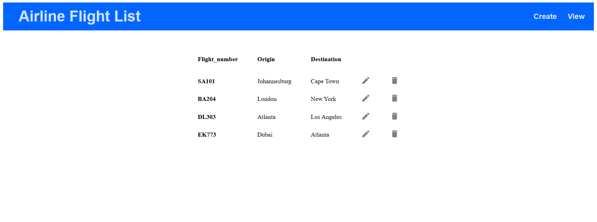
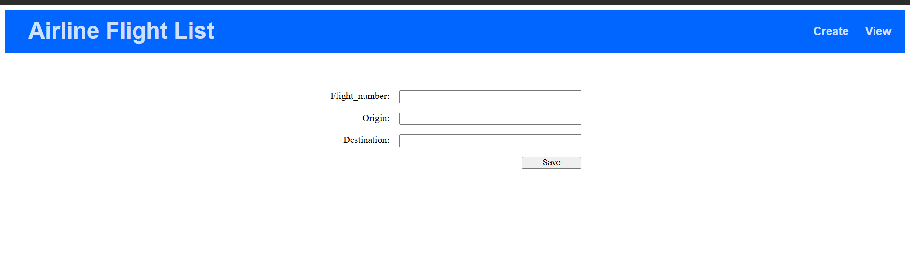
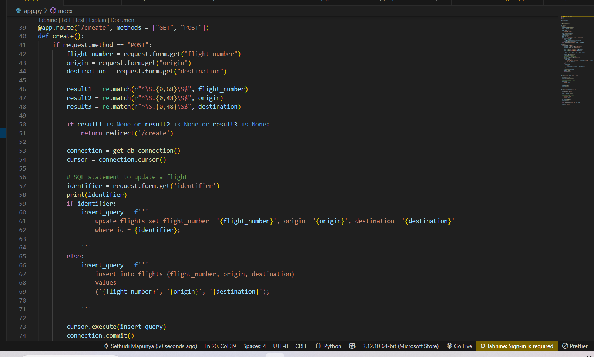
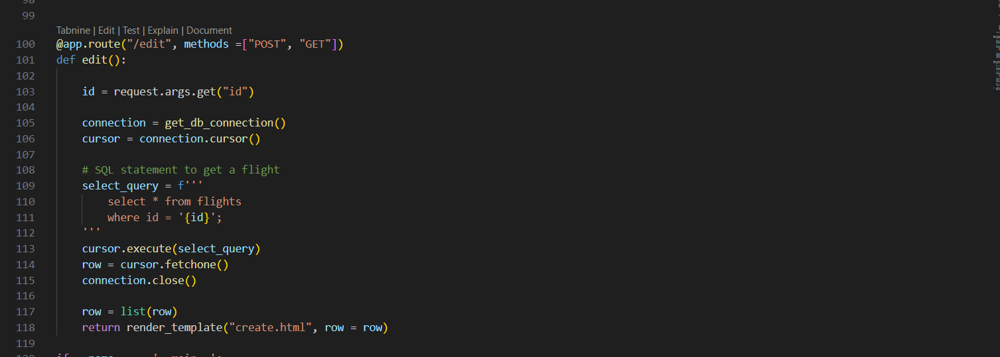
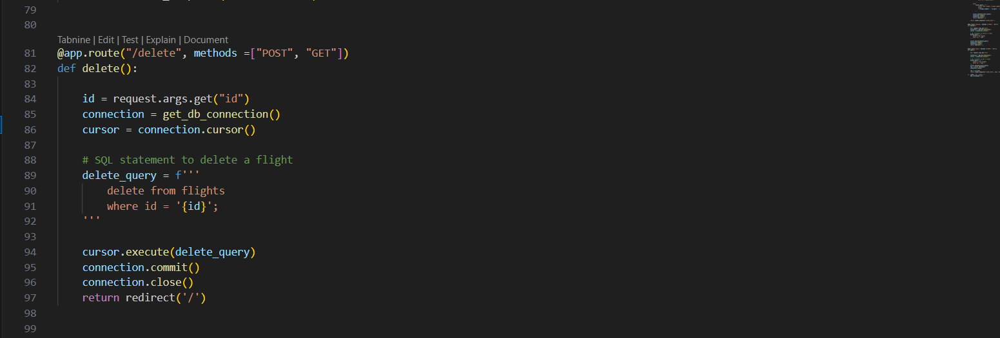

# csir-crud-flightsApp
**Access the web app here:**  [web app](https://csir-crud-flightsapp.onrender.com/).

The app shows an Airline Flight List, It's a list of flights. You can either Create, Read, Update or Delete them on the web app.
This is how it looks: 

Here is the home/ route in the backend to list the flights:

When you click the create button, this is what you see. A form to create a flight and save it:

This is the backend code responsible for the functionality of creating a flight:

If you want to edit a particular flight, just click the edit icon and you'll get a form populated with that flight. Similarly, if you want to delete it, press the delete button.
Here is the code for Edit and delete:

