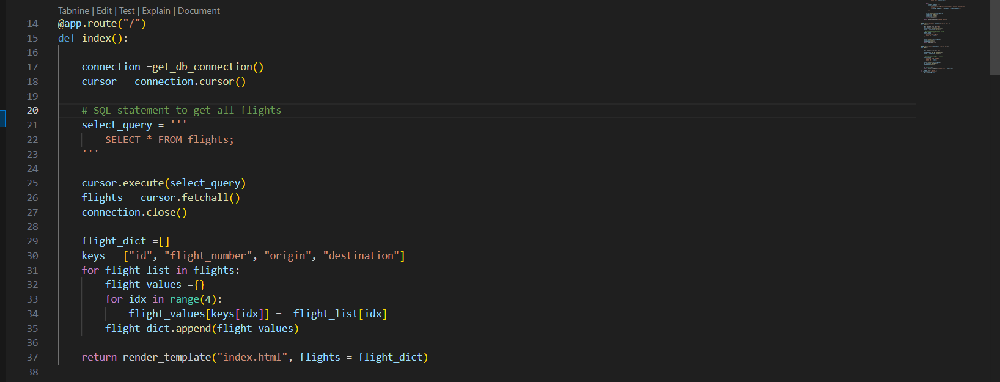

# csir-crud-flightsApp
**Access the web app here:**  [web app](https://csir-crud-flightsapp.onrender.com/).

The app displays an Airline Flight List — a list of flights. You can Create, Read, Update, or Delete flights using the web app.
Here's what it looks like: 

Here is the / (home) route in the backend that lists the flights:

---

When you click the Create button, you’ll see a form where you can add a new flight and save it:

This is the backend code responsible for handling the creation of a flight:

---

If you want to edit a particular flight, just click the edit icon — a form will appear pre-filled with that flight's details.
Similarly, to delete a flight, click the delete button.

Here is the backend code for editing and deleting flights:

